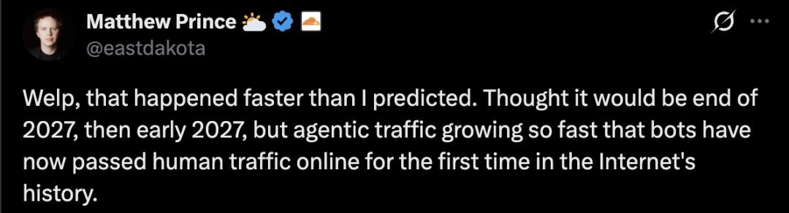

+++
date = '2026-08-10T17:05:20+08:00'
draft = false
title = '第一期：盛夏光年'
cover = 'https://pmvincent-1257701794.cos.ap-beijing.myqcloud.com/2026/08/10/17863527534828.jpg'
+++

题图：夏天就要去有山有水的地方，和物理世界连接

<!--more-->

## 本周值得分享
### Cloudflare财报分享AI流量已经超过人类流量
本周shock到我的一个信息是看到Cloudflare说AI在互联网上的流量已经超过了人类，而且这个速度比他们内部预测的还要快：原本预测2027年底才越线，后来改口2027年初，结果2026年5月就达成了。

如果照这么发展下去，未来五年后，机器流量会是人类的1000倍。那个时候注意力经济很可能已经不是互联网第一大商业模式了，反而有很多基建会成为大生意，比如Agent之间的连接，小额的访问支付等，互联网内容生态也会发生翻天覆地的变化，网站UI也没有那么重要了，毕竟已经不需要人去看了，想想还挺震惊的。

> 来自：《今天，互联网不再只属于人类，Cloudflare实锤机器流量反超》，https://www.36kr.com/p/3932854014393475

### Jeff Dean的分享
https://mp.weixin.qq.com/s?__biz=MjM5MDE0Mjc4MA==&mid=2651290190&idx=1&sn=a751a30e12ea7903302e55dd0aa94b07&scene=21&poc_token=HN2OeWqj-LHHtXvbaWWUPybWMqhfVHohIDRZwAEn

### LWF的分享
核心观察和趋势判断

## 随便写写
codex的效果已经不如deepseek v4 flash了

AI办公大战
https://mp.weixin.qq.com/s?__biz=MzU3Mjk1OTQ0Ng==&mid=2247537832&idx=1&sn=d9a795ebff15c009b503ee63ae9c8d2f&chksm=fdabb7206146c3db170a23d09fe34c0dcfa78f9ef88dde8c29d37416de1fcaa3e2eb85e7525f&scene=0#rd

## 创造记录
- 截长图app进展以及心得